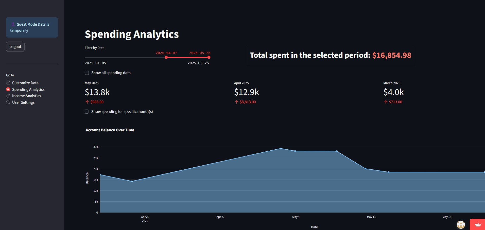

# Finance Dashboard

A personal finance dashboard built with Streamlit that tracks spending, categorizes transactions, and provides insights into financial habits. Supports bank statements from Revolut.

# Overview

[More screenshots](img/IMAGES.md)

## Features
- 🔐 User authentication with data encryption
- 📊 Interactive spending analytics and visualizations
- 🏷️ Automatic transaction categorization
- 💾 Cloud data storage via private GitHub repository
- 📱 Mobile-friendly responsive design
- 👤 Guest mode for trying the app without registration

## Demo
🚀 **Live App**: https://revolut-data-analysis.streamlit.app
Note: Streamlit Cloud may hibernate the app after a period of inactivity, press on "wake up app", then you'll probably see an error message, ignore it, the page will refresh itself eventually (if it doesn't for 1-2 minutes refresh the page manually) and the app will load after a few seconds.

## Deployment
This app is deployed on Streamlit Cloud with encrypted data stored securely in a private GitHub repository.

### ✅ PROD Status
- ✅ login/registration for users
- ✅ password encryption
- ✅ changes committed to private GitHub repository
- ✅ change password feature
- ✅ user data encryption
- ✅ user data deletion option

## Contact
- [Website](https://leviipope.github.io/cv-website) - outdated, but contains contact information
- [LinkedIn](https://www.linkedin.com/in/levente-polg%C3%A1ri-9681a0303/)
